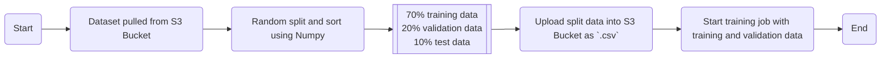

# AWS Lambda Model Training

[](https://www.python.org/downloads/release/python-3121/)
[](https://github.com/kwame-mintah/aws-lambda-model-training/actions/workflows/bump-repository-version.yml)
[](https://github.com/kwame-mintah/aws-lambda-model-training/actions/workflows/push-docker-image-to-aws-ecr.yml)
[](https://github.com/kwame-mintah/aws-lambda-model-training/actions/workflows/run-python-linter.yml)

A lambda to split pre-processed data into, training, validation and test datasets uploaded to an S3 bucket. Training and validation
datasets will be used when starting the AWS SageMaker training job and the test data will be used during [model evaluation](https://github.com/kwame-mintah/aws-lambda-model-evaluation).

This repository does not create the AWS resources, this is created via Terraform found here [terraform-aws-machine-learning-pipeline](https://github.com/kwame-mintah/terraform-aws-machine-learning-pipeline).
For more details on the entire flow and how this lambda is deployed, see [aws-automlops-serverless-deployment](https://github.com/kwame-mintah/aws-automlops-serverless-deployment).

# Flowchart

The [diagram below](https://mermaid.js.org/syntax/flowchart.html#flowcharts-basic-syntax) demonstrates what happens when the lambda is trigger, when a new `.csv` object has been uploaded to the S3 Bucket.



# Notice

The code provided here should serve as an example for creating a lambda function to start a AWS SageMaker training job.
Training algorithm used within this project is [XGBoost](https://docs.aws.amazon.com/sagemaker/latest/dg/xgboost.html) so
hyperparameters may not be suitable for all algorithms.

Additionally, the hyperparameters values are currently hardcoded, one approach could be to read from a `manifest.json`
file detailing what parameters and value to use for each dataset received. This would allow for more flexibility, so
a new docker image does not need to be deployed, when hyperparameters need to be changed.

## Development

### Dependencies

- [Python](https://www.python.org/downloads/release/python-3121/)
- [Docker for Desktop](https://www.docker.com/products/docker-desktop/)
- [Amazon Web Services](https://aws.amazon.com/?nc2=h_lg)

## Usage

1. Build the docker image locally:

   ```shell
   docker build --no-cache -t model_training:local .
   ```

2. Run the docker image built:

   ```shell
   docker run --platform linux/amd64 -p 9000:8080 model_training:local
   ```

3. Send an event to the lambda via curl:
   ```shell
   curl "http://localhost:9000/2015-03-31/functions/function/invocations" -d '{<REPLACE_WITH_JSON_BELOW>}'
   ```
   <details>
   <summary>Example AWS S3 event received</summary>
   ```json
   {
     "Records": [
       {
         "eventVersion": "2.0",
         "eventSource": "aws:s3",
         "awsRegion": "us-east-1",
         "eventTime": "1970-01-01T00:00:00.000Z",
         "eventName": "ObjectCreated:Put",
         "userIdentity": { "principalId": "EXAMPLE" },
         "requestParameters": { "sourceIPAddress": "127.0.0.1" },
         "responseElements": {
           "x-amz-request-id": "EXAMPLE123456789",
           "x-amz-id-2": "EXAMPLE123/5678abcdefghijklambdaisawesome/mnopqrstuvwxyzABCDEFGH"
         },
         "s3": {
           "s3SchemaVersion": "1.0",
           "configurationId": "testConfigRule",
           "bucket": {
             "name": "example-bucket",
             "ownerIdentity": { "principalId": "EXAMPLE" },
             "arn": "arn:aws:s3:::example-bucket"
           },
           "object": {
             "key": "automl/example-bank-file.csv",
             "size": 515246,
             "eTag": "0e29c0d99c654bbe83c42097c97743ed",
             "sequencer": "00656A54CA3D69362D"
           }
         }
       }
     ]
   }
   ```
   </details>

## GitHub Action (CI/CD)

The GitHub Action "🚀 Push Docker image to AWS ECR" will check out the repository and push a docker image to the chosen AWS ECR using
[configure-aws-credentials](https://github.com/aws-actions/configure-aws-credentials/tree/v4.0.1/) action. The following repository secrets need to be set:

| Secret             | Description                  |
|--------------------|------------------------------|
| AWS_REGION         | The AWS Region.              |
| AWS_ACCOUNT_ID     | The AWS account ID.          |
| AWS_ECR_REPOSITORY | The AWS ECR repository name. |
